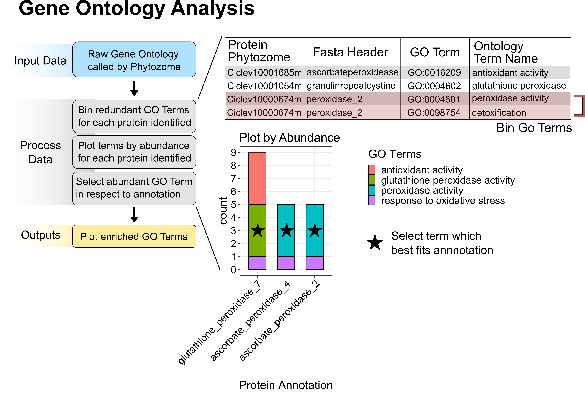

# Citrus vascular proteomics highlights the role of peroxidases and serine proteases during Huanglongbing disease progression

Jessica Y. Franco1, Shree P. Thapa1, Zhiqian Pang2, Fatta B. Gurung3, Thomas W. H. Liebrand1, Danielle M. Stevens1, Veronica Ancona3, Nian Wang2, Gitta Coaker1.

1Department of Plant Pathology, University of California, Davis, USA  
2Citrus Research and Education Center, University of Florida, Lake Alfred, USA  
3Citrus Center, Texas A&M University, Weslaco, Texas, USA  

-----------------------

Purpose: The script in this repository is for processing and ploting z-scores from total proteomic data as well as Go-terms (Gene Ontology). If you have any questions, concerns, or found a bug, please contact me at dmstev@ucdavis.edu.

Due to the redundacy of go-terms called for each protein present, we had to first make a custom script to:
 1) bin the terms by the protein called
 2) plotted to assess which terms are most abundant
 3) selected based upon the annotation of the protein
 
This list is then writen out to the file. This output (labeled-Filtered_GO_terms_to_plot.xlsx) is then inputed, organized and plotted. Specifically, it:
 1) bins the number of proteins based upon their desginated go-terms (molecular function and biological proccess) 
 2) plots weather the term was significantly significantly downregulated or upregulated
 
 Finally, normalized z-scores were clustered and plotted with additonal meta data collected in the study.
 
&nbsp;
 Information regarding R and package versions can be found in the session_info.txt document. 
 
 
NOTE: There is one known problem with the script. On occasion, I have had issues wth the installation and loading of the ComplexHeatmap package. I suspect this may be due to myself working on a windows computer. The current fix I have is reinstalling the package, sometimes using different methods of installation (devtools vs. BiocManager), which one can see in the script. This should fix the issue and allow you to run the script.

&nbsp;
&nbsp;
&nbsp;

&nbsp;

#### Paper can be found on bioRxiv ([here](https://doi.org/10.1101/2020.04.05.025718))

